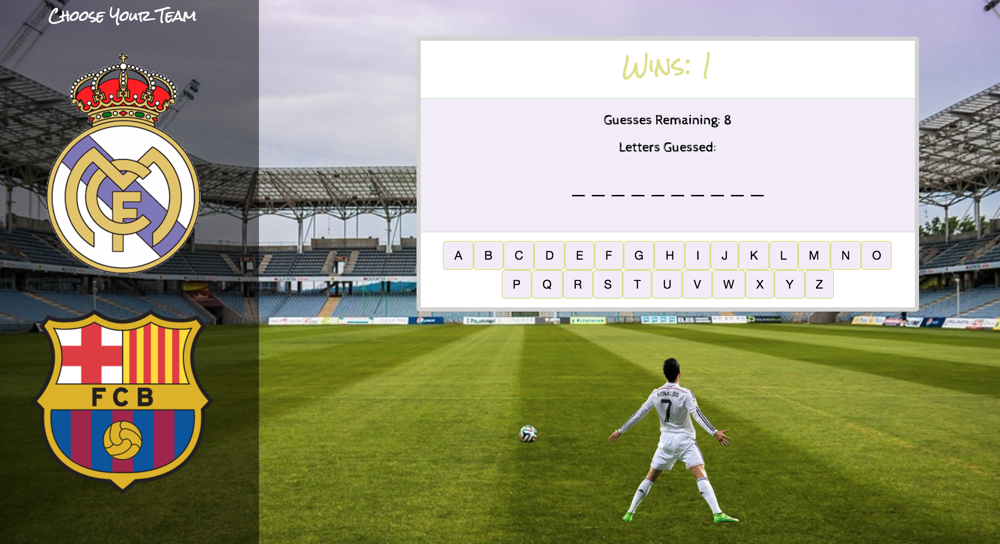
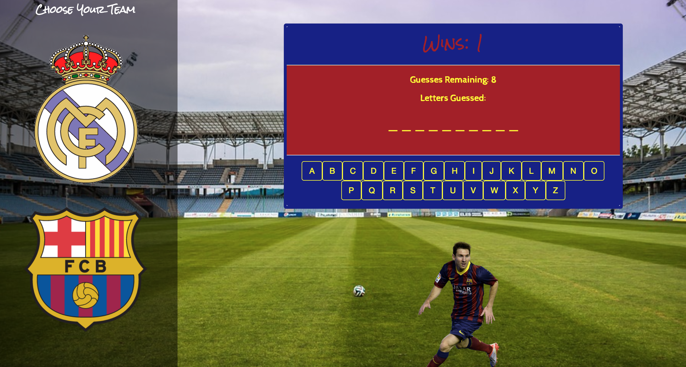

# Soccer Hangman Game

Simple Hangman game developed with web Front-end technology. It has a soccer theme and you can choose the theme based on the colors of two famous Soccer Clubs in Spain: Real Madrid! and Barcelona (Booo)

## Getting Started
To play all you have to do is go to https://cesarc770.github.io/Hangman-Game/

If you choose Real Madrid you will get this screen

If you don't make the right choice you will get this other theme...

The logic of the game is simple. You have to guess the letters right in order to win.  You can play as many times as you want.

## Built With

* HTML, CSS, Javascript and jQuery

## Authors

* **Cesar Caceres** - *Design and Development*

## Acknowledgments

* Hat tip to the Spanish League (La Liga)
* Inspiration derived from my favorite Sport and my favorite Team... and its rival

